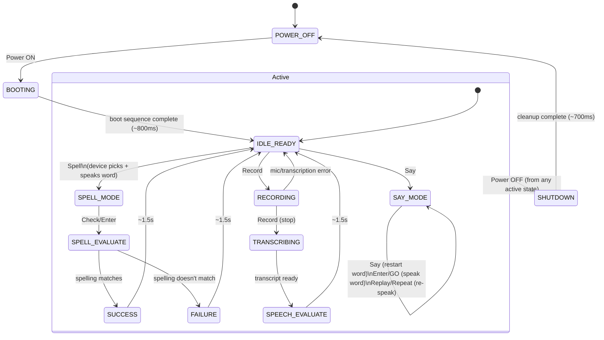

# Play Modes

SpellBook has three distinct play modes, entered from the idle screen once the device is powered on. This doc describes what each one does and how they map to the device's internal state machine (`DeviceState` in `js/spellbook.js`).

## 1. Say It

The classic Speak & Spell "say it back to me" mode: you type a word, the device speaks it.

1. Press **Say** to enter `SAY_MODE`. The VFD prompts `TYPE A WORD`.
2. Type letters on the A–Z keys. Each keystroke is echoed to the VFD but stays silent — nothing is spoken yet.
3. Press **Enter**/GO to have the word synthesized aloud (Piper TTS, falling back to the browser's `speechSynthesis` if Piper isn't loaded).
4. Press **Replay** or **Repeat** to hear the same word again without retyping it.
5. Press **Say** again at any point to clear the buffer and start composing a new word.

Say It never picks a word for you — composing and hearing arbitrary words is the whole point of this mode. It doesn't check spelling or grade anything.

## 2. Spell It

The quiz mode: the device picks a word, speaks it, and you type it back.

1. Press **Spell** from the idle screen to enter `SPELL_MODE`. The device picks a random word (avoiding an immediate repeat of the last one), shows `TYPE WORD:`, and speaks the word aloud.
2. Type your spelling attempt on the A–Z keys — nothing is spoken back per letter here, matching the original hardware.
3. Press **Erase** to backspace, **Space** to insert a space.
4. Press **Check**/Enter to submit. The device compares your typed word to the target (case-insensitive) and moves to `SPELL_EVALUATE`:
   - Match → `CORRECT!` tone, `SUCCESS` state.
   - No match → `TRY AGAIN` tone, `FAILURE` state.
5. After 1.5 seconds the device clears the target word and returns to the idle screen.
6. Press **Replay** while still in `SPELL_MODE` to have the device repeat the target word's prompt.

Spell It's word choice is entirely independent of Say It — it doesn't need you to have said anything first, and picking a word here doesn't affect what Say It will speak next.

## 3. Listen (voice capture)

A dictation-style mode built around the mic button, currently separate from the spelling quiz.

1. Press **Record** from the idle screen to start listening (`RECORDING`); the mic LED lights up.
2. Press **Record** again to stop. The device moves through `TRANSCRIBING` while Whisper ASR processes the audio.
3. Once a transcript is ready, the device shows `YOU SAID: <transcript>` (`SPEECH_EVALUATE`), then returns to idle after 1.5 seconds.
4. If the mic or transcription fails, the device shows `ERROR` and returns to idle after 1 second.

Unlike Spell It, this mode doesn't grade anything against a target word yet — it's a straight speech-to-text echo. Wiring it into the spelling quiz (e.g. "say the word you just spelled") is a natural next step but isn't implemented.

## State machine

Every mode above is a path through the same finite state machine. **Power** is the one control that works everywhere: pressing it from any active state interrupts whatever's happening and shuts the device down.

## Known gaps

- The **Hint** button described in `.github/instructions/instructions.md` §10 doesn't exist in `index.html` — no reveal-a-letter affordance is implemented for Spell It.
- Listen mode's transcript isn't checked against anything — it's not yet a third way to "win" a round the way Spell It is.
